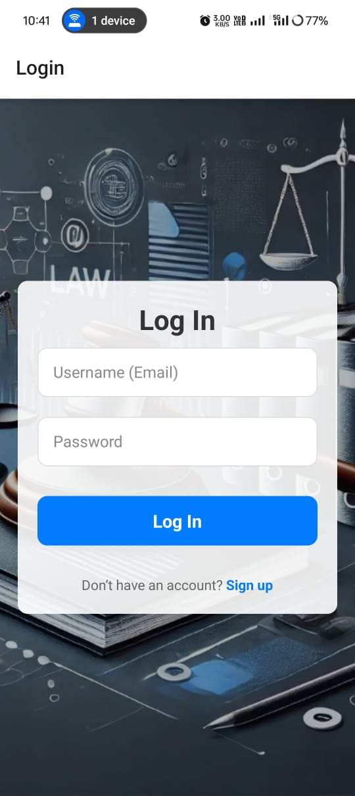
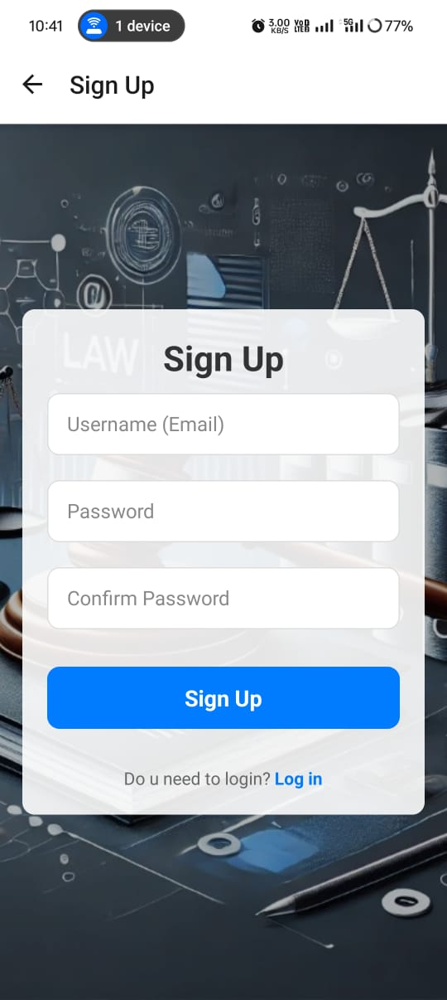
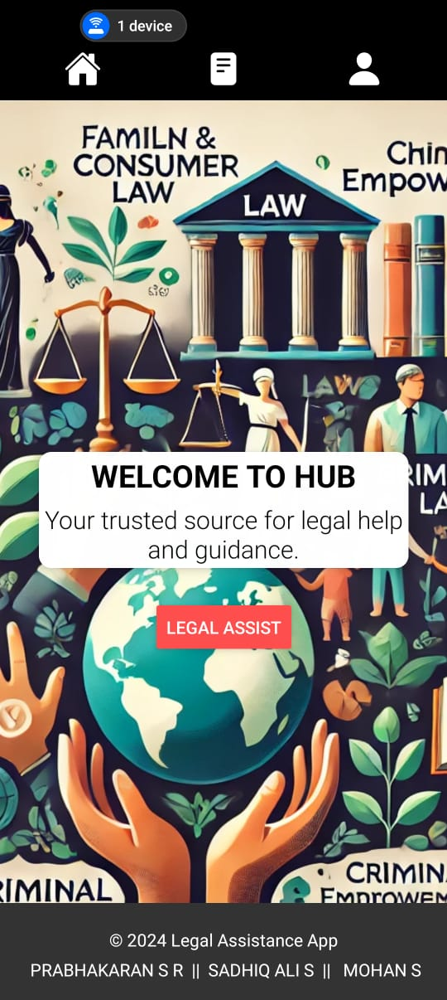
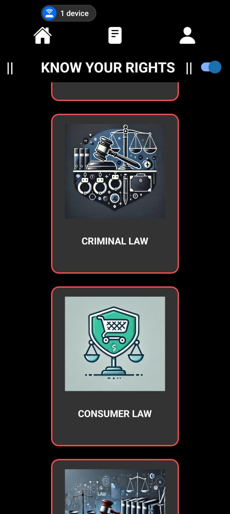
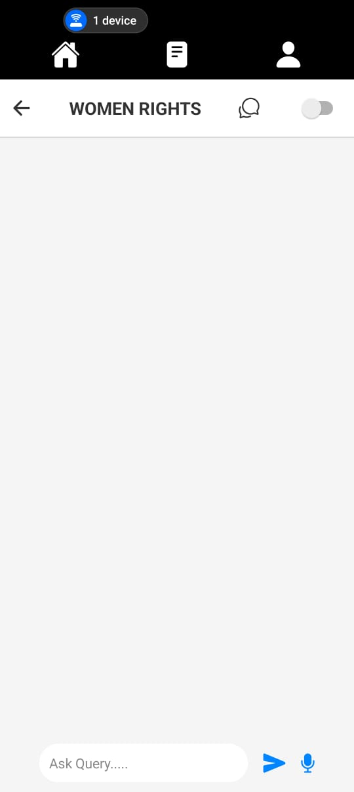
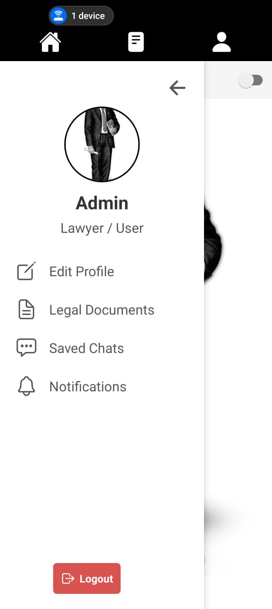

# PROJECT PHASE - 1 :  🏛️ Legal Assistance Chatbot

An AI-powered legal chatbot designed to provide users with simplified and accessible legal information. The chatbot categorizes legal topics and assists users with queries while ensuring **privacy and security** using blockchain.

---

## 📌 Abstract

Understanding legal frameworks can be challenging for common people. This project aims to develop an AI-powered **legal assistance chatbot** that provides users with basic legal guidance. The chatbot categorizes legal topics, answers legal queries in an accessible format, and detects complex cases using predefined keywords. 

### Key Features:
✅ AI-powered chatbot with legal knowledge
✅ Categorized legal topics for easy navigation
✅ Works **online** with preloaded legal content
✅ Uses **blockchain** for data privacy and authentication
✅ Developed using **React Native (Frontend) & Python-Flask (Backend)**

---

## 🛠️ Tech Stack & Tools

| Technology | Usage |
|------------|--------|
| **React Native** | Frontend (User Interface) |
| **Python(Flask)** | Backend API & chatbot logic |
| **Firebase/Auth** | User authentication |
| **Expo CLI** | Mobile development framework |
| **Blockchain (Ethereum, Solidity, Metamask, Ganache)** | Data privacy and security |
| **Machine Learning (TensorFlow.js, NLP libraries)** | AI chatbot responses |
| **Redux Toolkit** | State management |

---


## 📸 Screenshots

### User Interface Preview

<table>
  <tr>
    <td></td>
    <td></td>
  </tr>
  <tr>
    <td></td>
    <td></td>
  </tr>
  <tr>
    <td></td>
    <td></td>
  </tr>
</table>


## 🚀 Installation & Setup

1️⃣ Clone this repository:
```sh
 git clone https://github.com/your-username/legal-assistance-chatbot.git
 cd legal-assistance-chatbot
```

2️⃣ Install dependencies:
```sh
 npm install  # Install required packages
```

3️⃣ Run the application:
```sh
 expo start  # Starts the development server
```

---

## 📬 Contributing
Feel free to contribute to this project! Fork, create a new branch, make your changes, and submit a pull request.

---

## 📜 License
This project is licensed under the MIT License.

---

## 📞 Contact
🔗 **LinkedIn:** [prabhakaran-s-r](https://www.linkedin.com/in/prabhakaran-s-r)  
 
📧 **Email:** [srprabha17@gmail.com]
